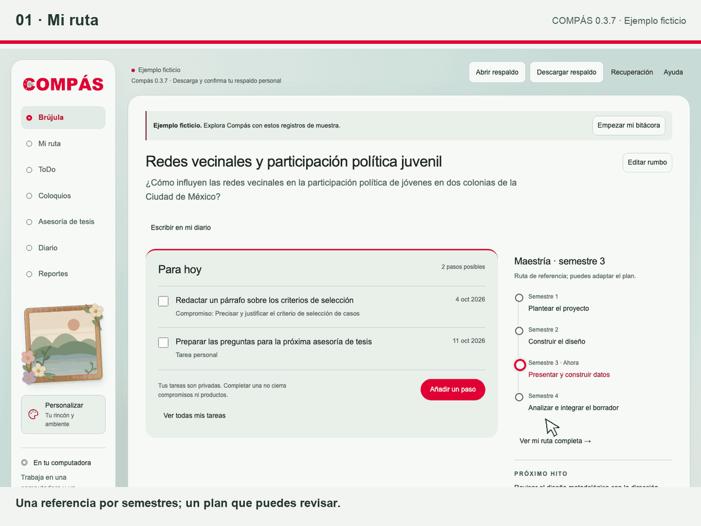
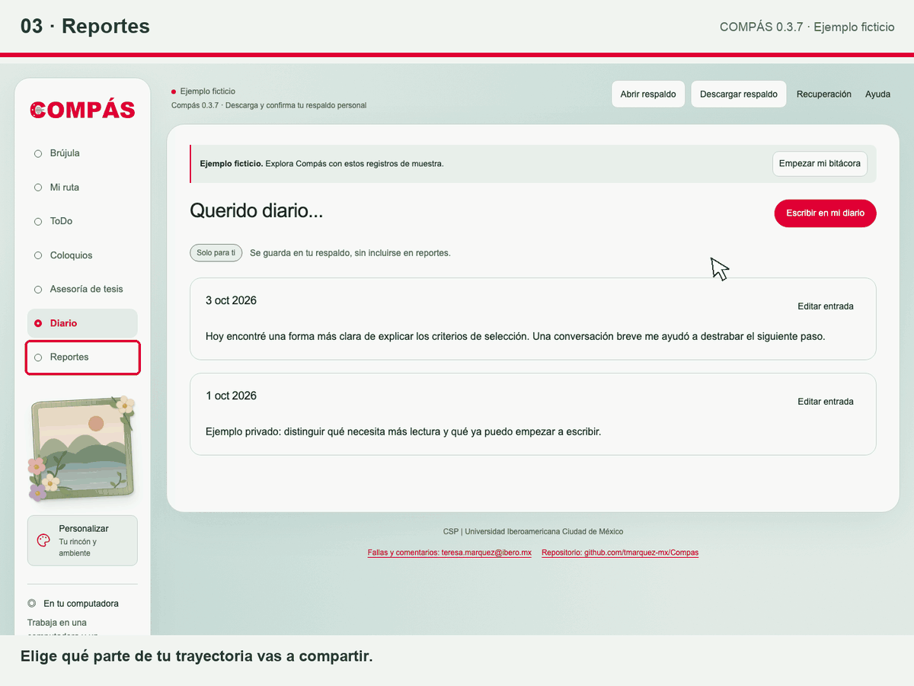

# Compás
**Organiza y da seguimiento a tu tesis**

Decisiones, acuerdos y próximos pasos, en un solo lugar.

Una aplicación personal para organizar el proceso de tesis en maestría y doctorado: ruta por semestres, acuerdos, decisiones, supervisión, tareas y dedicación.

## Compás en acción

Dos recorridos animados con datos ficticios. Haz clic en cada imagen para verla a mayor tamaño.

### Mi ruta: planea y conserva la historia de tus ajustes

Explora los productos por semestre, ajusta las fechas de tu plan y registra el motivo del cambio. El historial te permite recuperar cómo y por qué fue cambiando tu ruta de tesis.

### Reportes: comparte los avances que tú eliges

Selecciona los registros que quieres compartir, revisa la vista previa y genera un reporte en HTML, Excel o PDF mediante la impresión del navegador. Tus tareas ToDo, horas, reflexiones y notas privadas quedan fuera del reporte.

## Descargar y empezar

### [Descargar Compás para Windows y Mac (.zip)](https://github.com/tmarquez-mx/Compas/releases/latest/download/Compas-para-tesistas.zip)

## Importante: avisa que probarás Compás

Después de descargar Compás, escribe a [posgrado.sociales@ibero.mx](mailto:posgrado.sociales@ibero.mx) e indica que lo descargaste y que lo probarás. Así, la Coordinación podrá avisarte por correo cuando haya una nueva versión para que actualices tu copia. Si no das este aviso, podrías quedarte con una versión desactualizada.

1. Descarga el ZIP y **descomprímelo por completo**.
2. Abre la carpeta **Compas** y lee **Empezar-aqui.html**.
3. Abre **Compas.html** en un navegador actualizado.
4. Elige **Empezar mi bitácora** o explora el ejemplo ficticio.
5. Al terminar, pulsa **Descargar respaldo**, localiza el archivo y confirma **Ya guardé el archivo**.

Esta primera versión está pensada para usarse en una sola computadora y un mismo navegador. Conserva una sola copia de trabajo y descarga respaldos periódicamente.

No necesitas instalar Python, Node ni otras herramientas. Puedes trabajar sin internet.

El ZIP contiene la aplicación, instrucciones, manifiesto y huellas de integridad; puede incluir el video demo. Es el mismo paquete para Windows y Mac. La interfaz se ha comprobado en Mac mediante servidor local; quedan pendientes la apertura directa del archivo descargado y la prueba en un equipo Windows.

[Versiones publicadas](https://github.com/tmarquez-mx/Compas/releases) · [Descargar el video demo](https://github.com/tmarquez-mx/Compas/releases/latest/download/Compas-demo.mp4)

## Qué incluye

- **Brújula:** hasta tres pasos pendientes, posición en la ruta, próximo hito y decisiones.
- **Mi ruta:** maestría o doctorado, semestres, productos, versiones y ajustes de la planeación.
- **ToDo:** tareas privadas con fechas, prioridades y vínculos con compromisos o productos; importación local de archivos CSV e ICS con vista previa y selección.
- **Coloquios y Supervisión:** sesiones, retroalimentación y seguimiento de acuerdos.
- **Dedicación:** actividades, horas y reflexiones personales.
- **Reportes:** selección de avances para compartir como HTML, Excel o PDF mediante la impresión del navegador.
- **Personalizar:** cuatro temas y una foto local opcional, en portarretratos o como fondo suave. La foto queda fuera de respaldos y reportes.

Las rutas son referencias en borrador. Compás no calcula el porcentaje de avance de una tesis ni otorga aprobaciones. La revisión de un producto o una minuta es un registro del tesista, sin firma verificada.

## Importar tareas a ToDo

En **ToDo → Importar tareas**, elige un archivo CSV o ICS guardado en tu computadora. La vista previa permite revisar y elegir qué incorporar. No necesitas conectar cuentas y la importación no mantiene sincronización con la aplicación de origen.

- **Notion:** exporta la base de tareas como [Markdown & CSV](https://www.notion.com/help/export-your-content), descomprime el ZIP y elige el CSV de la base.
- **Google Calendar:** [exporta el calendario desde la computadora](https://support.google.com/calendar/answer/37111), descomprime el ZIP y elige uno de sus archivos ICS.
- **Outlook clásico:** usa [Archivo → Guardar calendario](https://support.microsoft.com/en-us/outlook/export-an-outlook-calendar-to-google-calendar) para obtener un ICS; puedes limitar el rango de fechas.
- **Calendario de Apple en Mac:** elige un calendario y usa [Archivo → Exportar → Exportar](https://support.apple.com/es-lamr/guide/calendar/icl1023/mac). Compás admite ICS, no el archivo de todos los calendarios ICBU.

Se admiten archivos de hasta **2 MB y 1,000 registros**. En CSV, elige la columna de título y, si las necesitas, las de fecha, prioridad y estado. Confirma el orden de las fechas; las notas se incorporan únicamente si eliges esa opción. En ICS, los eventos elegidos se convierten en tareas con su día declarado, sin hora ni conversión de zona horaria. Las repeticiones no se despliegan y las cancelaciones y excepciones de series no se incorporan.

Nada se selecciona inicialmente. Revisa los títulos y fechas; te recomendamos descargar y comprobar un respaldo desde la vista previa antes de confirmar. Los duplicados detectados se omiten: repetir la importación no actualiza ni elimina tareas existentes. Puedes deshacer el lote durante diez segundos. Las tareas importadas siguen siendo privadas; quedan fuera de los reportes y se conservan en el respaldo personal.

## Tu bitácora y tus reportes

| Archivo | Uso |
| --- | --- |
| Compas.html | La aplicación que puedes abrir en tu navegador. |
| Respaldo personal JSON | Conserva todos los módulos y registros privados; se vuelve a abrir en Compás. |
| Reporte HTML, Excel o PDF | Contiene la selección que decides compartir. No sustituye al respaldo. |

La aplicación **no envía los registros a servidores** y no requiere cuentas. La descarga desde GitHub no le da acceso a tus anotaciones. El navegador puede conservar una copia auxiliar, pero esa copia puede borrarse: descarga y confirma respaldos regularmente. La edición se limita a una pestaña cuando el navegador permite un bloqueo exclusivo; sin él, los cambios permanecen en modo temporal. Las copias dañadas y las bitácoras reemplazadas pueden conservarse para recuperación.

Las tareas ToDo, las horas y sus totales, las reflexiones y las notas privadas quedan fuera de los reportes. El respaldo personal sí las contiene y no está cifrado. Si lo guardas en una carpeta sincronizada, también podrá almacenarse en la nube.

Registra decisiones metodológicas y revisiones de avances. Conserva fuera de Compás entrevistas, transcripciones, bases de datos e información que identifique a participantes de la investigación.

**No publiques respaldos personales ni datos de investigación en este repositorio o en sus incidencias.**

## Actualizar sin perder tu trabajo

Antes de sustituir la aplicación, descarga el respaldo desde tu versión actual. Cierra las pestañas de la versión anterior. Descarga y descomprime el nuevo paquete, abre Compas.html y usa **Abrir respaldo**. Los respaldos de la versión 1 son compatibles con esta versión.

## Fallas y comentarios

Escribe a [teresa.marquez@ibero.mx](mailto:teresa.marquez@ibero.mx). Consulta el [repositorio de Compás](https://github.com/tmarquez-mx/Compas). Describe qué ocurrió y qué navegador usas, sin compartir información privada.

## Para quienes revisan el código

La aplicación completa está en [dist/index.html](dist/index.html), generado desde [src/](src/). No edites el descargable a mano. La versión local es 0.3.6. Los registros incluidos en el ejemplo y las pruebas son ficticios.

[Entorno de desarrollo](docs/DESARROLLO-ENTORNO.md) · [Detalles de funcionamiento y validación](docs/DESARROLLO.md) · [Guía para tesistas](docs/EMPEZAR.md)

Ejecutar comprobaciones:

    npm test
    npm run check

Generar el paquete:

    python3 scripts/crear_paquete.py --video /ruta/Compas-demo.mp4

---

CSP | Universidad Iberoamericana Ciudad de México
